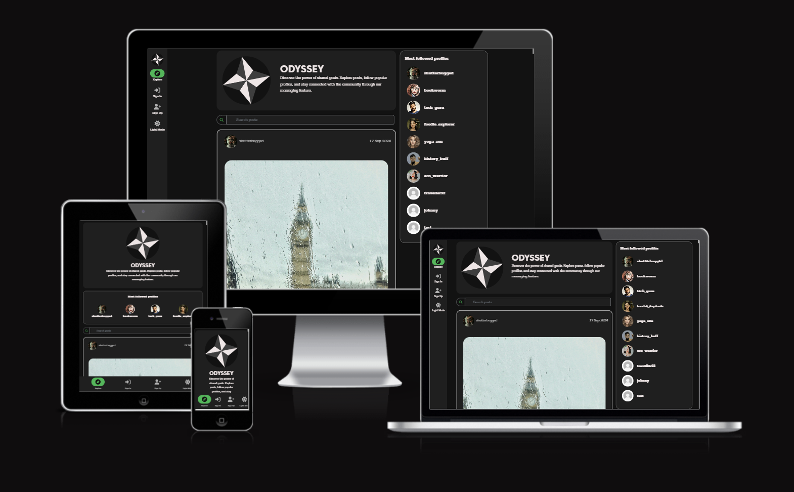

# Welcome to Odyssey

Odyssey is a social media app that allows users to find like-minded individuals working on similar goals.

# Features

The features enable users to interact with the app in a variety of ways. The app is designed to be user-friendly and intuitive, with a focus on real-time messaging and social media interactions.

## Messaging

- **Real-Time Messaging**: Engage in instant messaging with individuals or groups.

- **Message List**: View and scroll through a list of your active conversations.

- **Detailed Conversations**: Dive into specific messages within conversations, including media sharing.
- **Message Forms**: Easily send new messages in active conversations or start new conversations with others.

## Post, Comment and Like 

- **Create Posts**: Users can create posts and share them with their followers.
- **Share Images**: They can share images and text in their posts.
- **Follow and Like**: Users can follow other users and like their posts.

## User Authentication

  

- **Sign Up** Users can sign up for the app to create an account.
- **Sign In** Users can log into the app to access their personalized dashboard.

## Discover your favourite Profiles

- **Follow** Users can follow other users and view their posts on their dashboard.
- **View Profiles** Users can view detailed profiles of other users, which lists their posts
- **Update your information** Users can customise their own profiles with a profile picture and bio.
- **Unique Avatars** The profile picture appears on posts and in the message section. All users are assigned a default avatar.