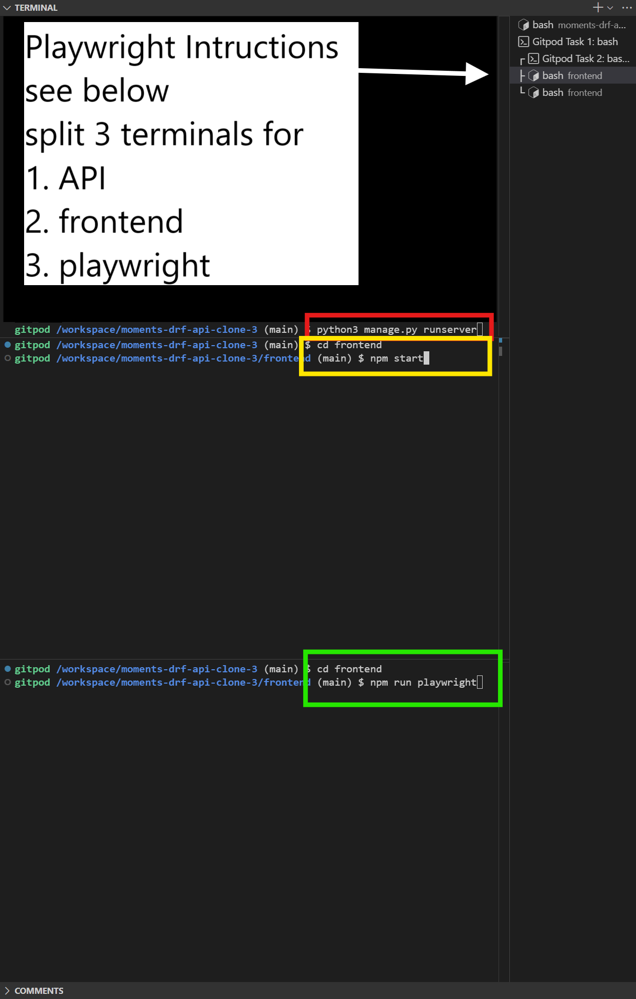

# Usage


# Installation

It would be advisable to use the [Gitpod IDE](http://gitpod.io) for the installation process, as it is pre-configured with the necessary tools and dependencies, especially around `nvm` and linking to the API.

To get the frontend app up and running locally, follow these steps:

1. **Clone the repository**:
   ```bash
   git clone http://github.com/lmcrean/odyssey_react.git
   ```

2.  Navigate to the `/frontend` directory
   ```bash
   cd frontend
   ```

3. **Install dependencies**:
   install the required dependencies:

   ```bash
   npm install
   ```

4. **Install correct node version**:
   Run the following command to check Node Version Manager (nvm) has installed the correct version of Node.js:

   ```bash
   nvm install 16
   ```

5. **Run build**:
   Run the following command to build the React app locally:
   ```bash
   npm run build
   ```

6. **Split the terminal, open the development server**:
   Split the terminal so we can run the API and frontend at the same time

   In terminal 1, run the API.
   ```bash
   python3 manage.py runserver
   ```


   In Terminal 2, go to `/frontend` and open the following command to start the React app locally:
   ```bash
   cd frontend
   npm start
   ```
   This should open in port `8080` or something similar - it will contain the latest changes.


## Committing to Production - Note on compiling static files


This command will delete the old `build` and replace it with the new one with `npm run build && rm -rf ../staticfiles/build && mv build ../staticfiles/. `

```bash
npm run deploy
```

You will need to re-run this command any time you want to deploy changes to the static files in your project, including the React code.


# Automated Testing Instructions

The project uses Jest, Playwright and Cypress for testing. The backend uses Django's built-in testing framework.

## Jest Testing

Tests are located in the `/__tests__` folder, interspersed throughout the js files in `/frontend` directory. To run the tests, use the following command:

First, ensure the frontend is opened with:

```bash
cd frontend
```

then run the tests with:
```bash
npm run test
```

## Playwright Testing


Tests are located in the `playwright` folder. To run the tests, use the following commands to **split 3 terminals**:

1. API
2. Frontend
3. Playwright


See the following diagram.




## Running Tests in terminal 3

To run all tests:

```bash
npx playwright test
```

To run a specific test, for example `frontend/playwright/auth.test.js`, you can use:

```bash
npx playwright test playwright/auth.spec.js
```

## shorthand commands

- Check `package.json` for more tests that have been shorthanded.

## Cypress Testing

Tests are located in the `cypress/integration` folder. To run the tests, use the following command:

1. Open 3 split terminals and run terminal one and two **exactly the same way as Playwright instructions**,

2. In terminal 3, run the following commands to set up cypress (shortened version of the commands for readability, see package.json):

```bash
cd frontend
npm run cypress 1
npm run cypress 2
npm run cypress 3
```

these commands will install prerequisites before finally installing cypress.

3. In the same terminal, run the following command to run the tests:

```bash
npx cypress open
```

or to run a specific test, for example `frontend/cypress/e2e/auth.cy.js` you can write something like this:

```bash
npx cypress run --spec "cypress/e2e/auth.cy.js"
npx cypress run --spec "cypress/e2e/user_journey.cy.js" --headed
```


# Automated Testing in Backend with python

Tests are located in the `tests` subfolders, each nested in the relevant app folder. To run the tests, use the following command:

```bash
python3 manage.py test
```

Before Starting the tests the following needs to be uncommented in `env.py file`:

```python
os.environ['DEV'] = '1' # Uncomment the following line to enable development mode
```
